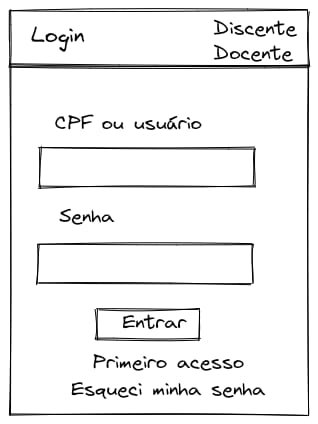
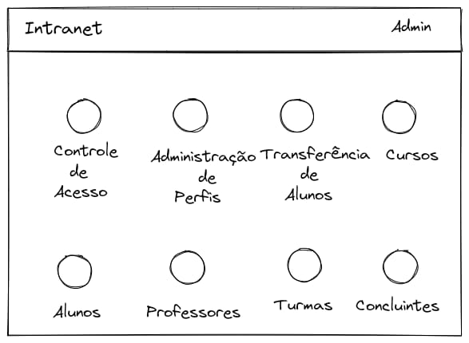
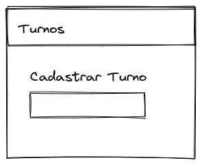
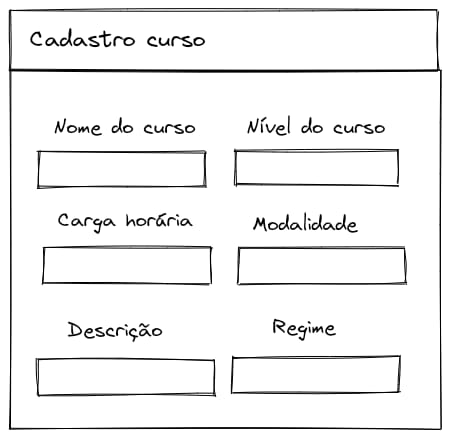
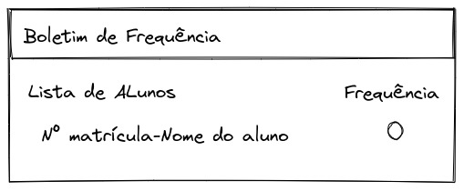

# Documento de Projeto de Software
## EasyAkademic

Sistema para gestão acadêmica

## Alunos envolvidos

- [Gabriele Alves](https://github.com/gabrielebonfim) - `Líder`
- [Antony Santos](https://github.com/Tonhass)
- [Jamile Jade Thomaz](https://github.com/JadeThom)
- [Júlio Cesar Rodrigues](https://github.com/juliorodrigues1)

*Corpo Inicial*

>Introdução
>
>Visão Geral do Projeto
>
>Premissas e Restrições
>
>Requisitos Funcionais e Requisitos Não Funcionais
>
>Layout/Prototipagem 

## Introdução

Sistema acadêmico que poderá ser personalizável
para diversos tipos de instituição de ensino. Os profissionais de ensino poderão utilizar como ferramenta de controle e gestão, e os alunos poderão utilizar como ferramenta de consulta (notas, avisos, atividades).

## Visão Geral do Projeto

Detalhe com mais precisão o modelo de negócio da aplicação, descreva aspectos como responsividade, objetivos específicos, como vai funcionar cadastro e interação no sistema, além de inovações envolvidas

## Premissas e Restrições

### Atores

Os Usuários do sistsitema vão ser professores, coordenadores e alunos.

### Regras de Negócios

Vai ser permitdo o cadastro de alunos, professores e coordenadores, para realizar a gerencia de do alunos tanto em notas como em presença, criação de atividade em forma de formulário.

## Requisitos Funcionais e Requisitos Não Funcionais

### Requisitos Funcionais

|ID| Nome|Descrição|
| :---: | --- | --- |
|RF01|Realizar Cadastro|O sistema deve ser capaz de disponibilizar área para que o usuário realize o cadastro de alunos, professores e coordenadores.|
|RF02|Laçamento de Notas|O sistema vai receber as nostas dos alunos calacula a media e definir se o usuário fará final ou não.|
|RF03|Portal do aluno|Portal para que o aluno possa acompanhar suas notas e sua frquencia nas matérias.|
|RF04|Gerar Certificado|O sistema vai ser capaz de gerar certificado para os alunos.|
|RF05|Amazenamento de Provas e trabalhos|O sistema vai armazenar provas e trabalhos para fins de registro e consultas.|

### Requisitos Não Funcionais

|ID| Nome|Descrição|
| :---: | --- | --- |
|RNF01|Controle de Acesso|O sistema só poderá ser acessado por usuário cadastrado|
|RNF02|Niveis de permissão|O sistema terá niveis de permissão onde uns usuários terão mais privilegios que outros|
|RNF03|Linguagem e framework|Será usada a linguagem python com o framework django|
|RNF03|Banco de dados|O banco de dados usado será postgresql|

## Layout/Prototipagem 

Insira nesta seção as possíveis telas do sistema ou o esboço do sistema, como preferir.

`É importante descrever um pouco o fluxo de cada tela.`

#### Exemplo 1 

  

#### Exemplo 2 

  

#### Exemplo 3 

  

#### Exemplo 4 

  

#### Exemplo 5 

  

